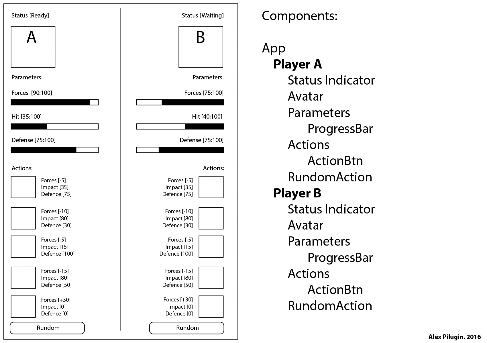
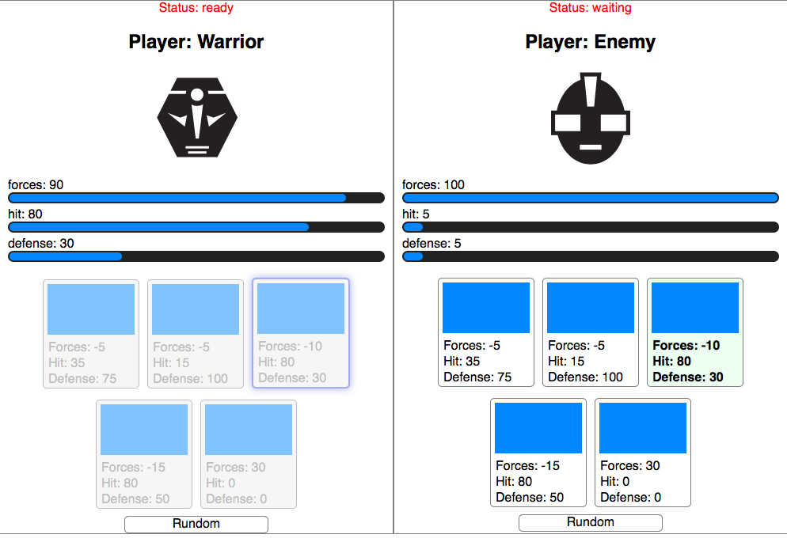

# react-game
I plan to create a simple interactive game to check my skills in React. 
1st step: planning: 
 
2nd step: **npm install -g create-react-app** (It was done before) 
**create-react-app my-react-game** 

I added .gitignore with "node_modules/" file to ignore all directories called node_modules in current folder and any subfolders.

[This app on AWS](https://goo.gl/FVJk2G)

